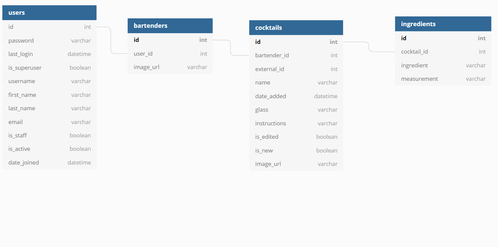

# Tenders
This is the Django REST API for Tenders. Once you have the server running, visit the repo for [Tenders's front-end application](https://github.com/coopnich/tenders-react).

## How to run Tenders

1. Clone down the repo and `cd` into it
1. Set up your virtual environment:

   `python -m venv TendersEnv`
1. Activate virtual environment:

   `source ./TendersEnv/bin/activate`
1. Install dependencies:

   `pip install -r requirements.txt`
1. Create a Superuser:

   `python manage.py createsuperuser`
1. Run migrations:

   `python manage.py makemigrations tendersapi`
   
   `python manage.py migrate`
1. Start the Server:

   `python manage.py runserver`

## ERD
